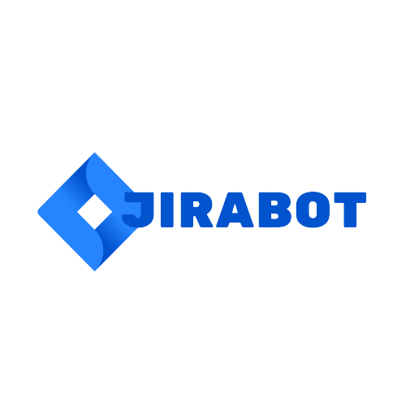

</a> 


# JiraBot

Projeto de chat bot para ajudar os usuários do Jira com perguntas frequentes de como utilizar a ferramenta. Inicialmente com um banco de dados simples na primeira versão, com possibilidade de aprimorar respostas para perguntas mais complexas e soluções de problemas.

O bot trabalha com um banco de dados interno onde é realizado as consultas. Ao executar o programa todas as perguntas são salvas no arquivo "perguntas_novas.txt". Caso sua pergunta não esteja no banco de dados, por favor compartilhe o arquivo em seguida para que possamos atualizar o banco de dados.

Este projeto é Open Source e qualquer pessoa pode contribuir com idéias, perguntas e respostas pertinentes ao Jira Software. Compartilhe!

## 🚀 Começando

Execute o arquivo **jiramain.py** em algum editor de código ou no próprio IDLE do Python. Em seguida basta iniciar a conversa com o bot após definir seu nome.

### 📋 Pré-requisitos

Para que você possa rodar o projeto você irá precisar:

```
python3
```

## 🛠️ Desenvolvido com

Este projeto está sendo desenvolvido com:

- Python 3.10.6
- ChatGPT API
- VS Code 
- Tkinter (em testes)

## 🖇️ Colaborando

Para colaborar siga os seguintes passos:

1 - Realize um Fork do projeto

2 - Crie um branch com a nova feature (git checkout -b feature/feature)

3 - Realize o Commit (git commit -m 'Adicionado conteudo')

4 - Realize o Push no Branch (git push origin feature/feature)

5 - Abra um Pull Request

## 📌 Versão

1.0

## ✒️ Autores

* **Lucas Barcat** - *Graduando em Engenharia de Computação* - [lbarcat](https://github.com/lbarcat)
* **Guilherme Neves** - *Graduando em Engenharia de Computação* - [NEVESGF](https://github.com/NEVESGF)

---
⌨️ com ❤️ por [Lucas Barcat](https://gist.github.com/lbarcat) 😊